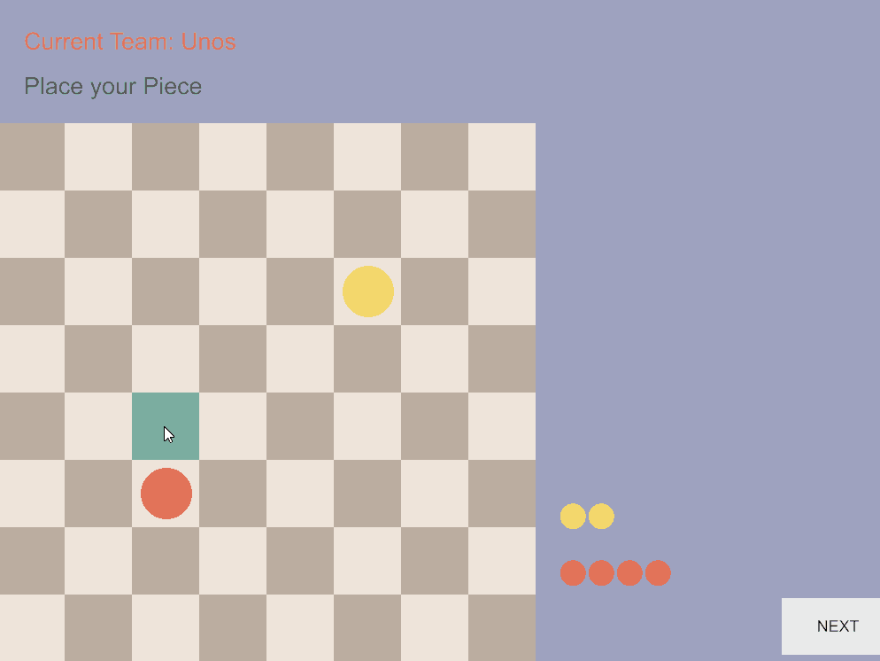
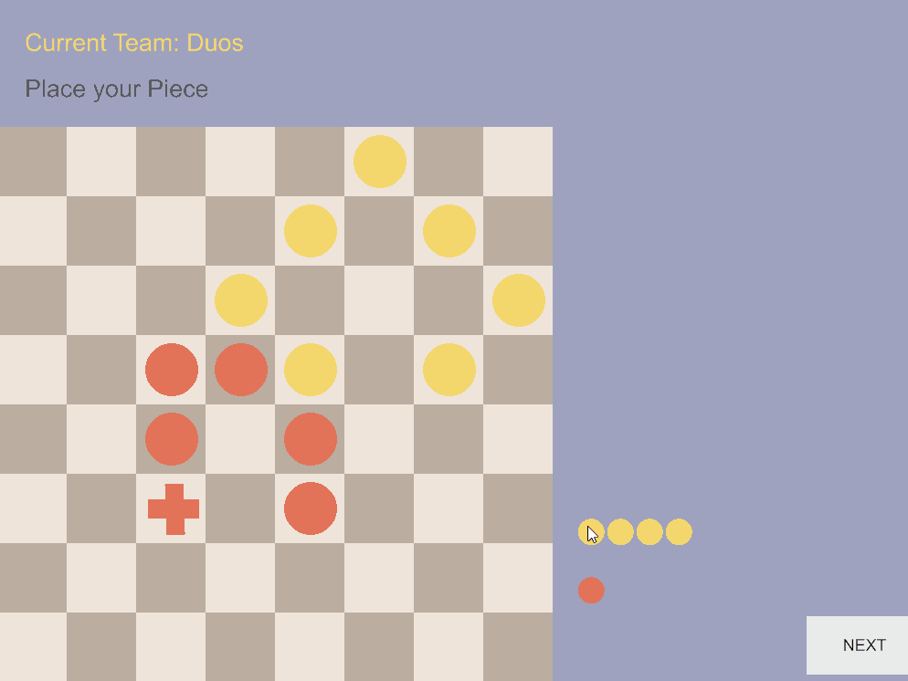
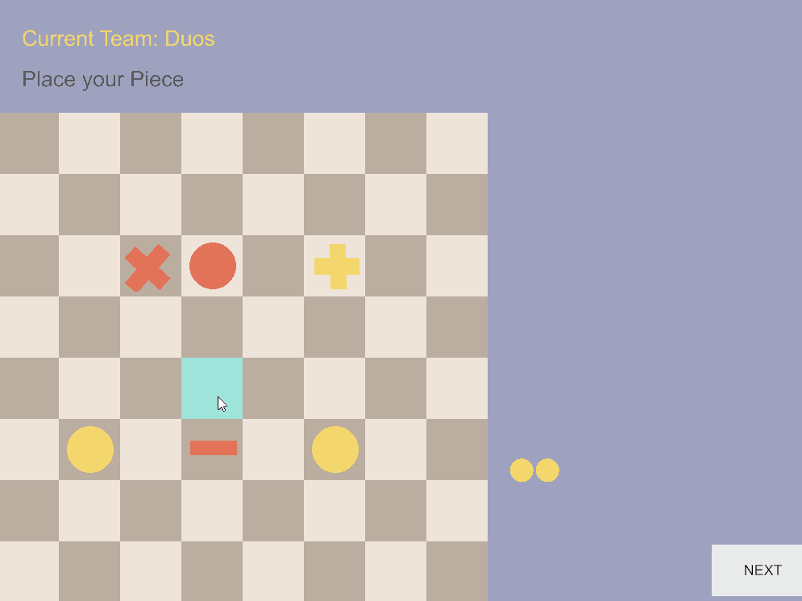

# Megachess
A turn based strategy game on a chess-like board. Be the first to destroy all of your opponent's pieces to win. 
Each turn the player can place new pieces and arrange them in patterns to create stronger ones with special powers and longer range.

*The game is still in an experimental pre-alpha phase*

## Technologies
* Programming language: **Rust**
* Game engine: **Amethyst**
 
## Screencasts
### Merge simple pieces into stronger ones

### Beware of Superpowers 

### Fierce Fights between Opponents

## Install
Please compile and run the game with Rust's *[cargo](https://doc.rust-lang.org/cargo/)* command in the root directory of the checked-out sources.

    cargo run

For mac or linux please enable `metal` instead of `vulcan` in the `Cargo.toml` file.
## How to Play?
Coming soon...  
