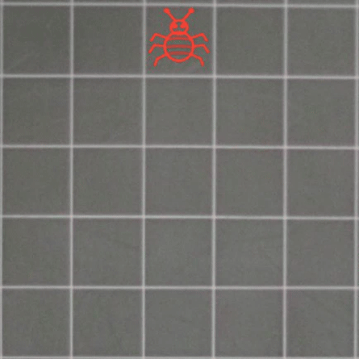
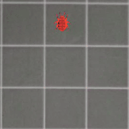
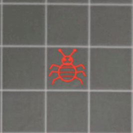
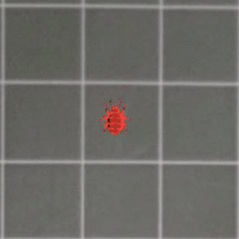
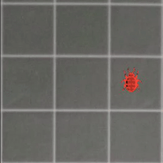
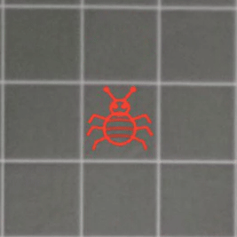

# Bugchess

A two-player turn-based strategy game on a chess-like board. Place pieces in spatial patterns to merge them into stronger types with special powers and longer range. Destroy all of your opponent's pieces to win.

*The game is in an experimental pre-alpha phase.*

## Merge Pieces

Place simple pieces in patterns to create powerful units:

| Queen | Castle | Cross |
|:---:|:---:|:---:|
|  |  |  |

| Sniper | Horizontal Bar | Vertical Bar |
|:---:|:---:|:---:|
|  |  |  |

## Play

Play online or offline (hot-seat) at **<https://heartlabs.eu>**.

Or compile and run locally:

```sh
cargo run
```

## Tech Stack

- **Language:** Rust
- **Rendering:** macroquad
- **Multiplayer:** matchbox (WebRTC peer-to-peer)
- **Deployment:** WASM → GitHub Actions → heartlabs.eu
